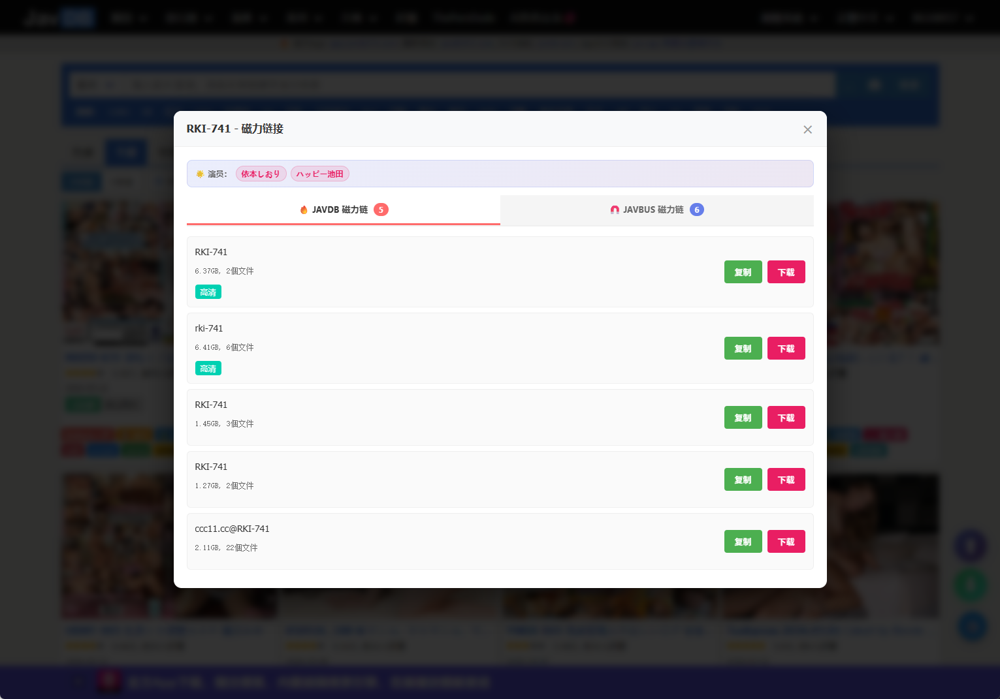
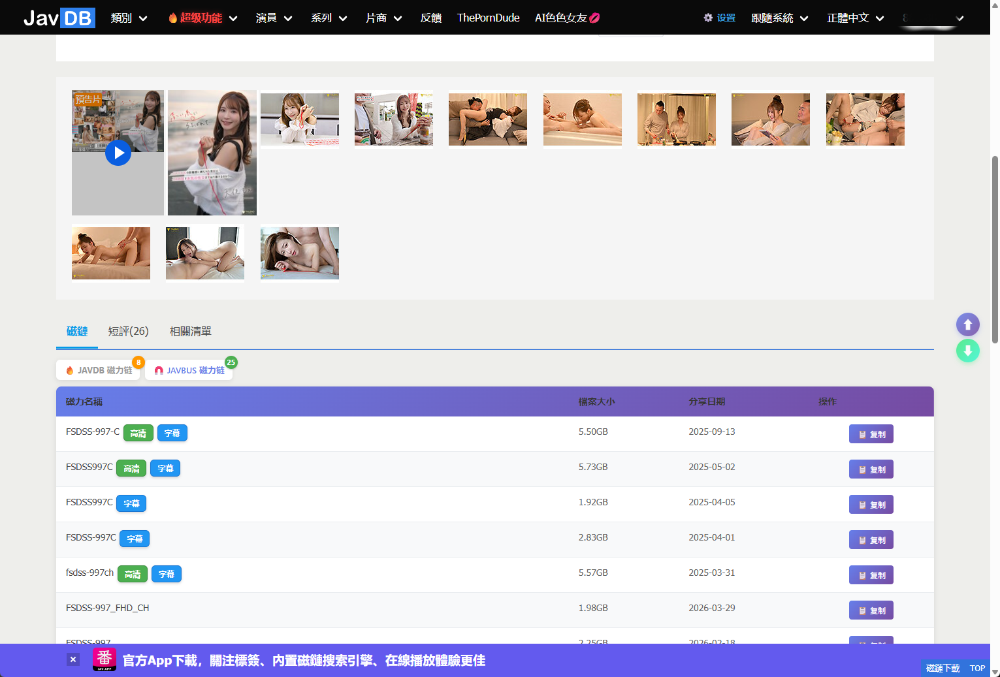

# JavdbBuddy (Javdb全能助手)

JAVDB 一站式增强 Tampermonkey 用户脚本，集成 Emby 入库状态同步、预览图查看、磁力链管理、多站点快捷搜索等功能。

> **English**: JAVDB All-in-One Assistant Tampermonkey userscript with Emby library sync, preview viewer, magnet links, and multi-site search.

---

## ✨ 功能特性

| 功能 | 说明 |
|------|------|
| 📋 **Emby 入库状态** | 列表页/详情页实时显示影片在 Emby 服务器中的入库状态 |
| 🖼️ **预览图查看** | 一键弹窗查看所有预览大图，支持全屏浏览 |
| 🧲 **磁力链管理** | JAVDB + JAVBUS 双标签磁力链弹窗，支持复制/下载 |
| 👩 **演员名单** | 预览图/磁力链弹窗顶部显示完整演员名单，可点击跳转 |
| 🔍 **多站点搜索** | 详情页一键搜索 98堂、BTSOW、JAVDB、JAVBUS、谷歌 |
| ⬆ **返回顶部/底部** | 右下角浮动按钮，快速跳转页面顶部或底部 |
| 📝 **短评查看** | 一键查看影片短评（需登录 JAVDB） |

---

## 📦 安装

### 方法一：Greasy Fork（推荐）
前往 [Greasy Fork 页面](https://greasyfork.org/scripts/564141) 点击安装。

### 方法二：GitHub Releases
从 [Releases 页面](https://github.com/86168057/JavdbBuddy/releases) 下载最新版本，在 Tampermonkey 中通过"从文件导入"安装。

### 方法三：手动安装
1. 安装 [Tampermonkey](https://www.tampermonkey.net/) 浏览器扩展
2. 打开 [JavdbBuddy_v0.4.0.js](https://github.com/86168057/JavdbBuddy/raw/main/JavdbBuddy_v0.4.0.js)
3. Tampermonkey 自动弹出安装提示

---

## 🚀 使用方法

### 列表页

- **小蓝按钮 🖼️ 预览图**：点击弹窗查看所有预览图
- **小粉按钮 🧲 磁力链**：点击弹窗查看 JAVDB + JAVBUS 双标签磁力链
- **小橙按钮 📝 短评**：点击获取影片短评

### 详情页

- **Emby 状态标签**：显示该影片的 Emby 入库状态
- **多站点搜索按钮**：一键在多个平台搜索该影片

- **JAVDB / JAVBUS 双标签**：点击切换不同来源的磁力链列表

---

## 🔧 Emby 配置

1. 点击页面右下角的 ⚙️ 设置按钮
2. 添加 Emby 服务器地址和 API Key
3. 点击"同步服务器"按钮，脚本将自动扫描 Emby 库建立索引
4. 完成！列表页和详情页将显示 Emby 入库状态

---

## 📄 脚本说明

- **脚本名**: JavdbBuddy (Javdb全能助手)
- **版本**: 0.4.0
- **适用站点**: javdb.com
- **依赖**: 需要 Tampermonkey / Violentmonkey 等用户脚本管理器
- **许可**: MIT License

---

## 🤝 贡献

欢迎提交 Issue 和 Pull Request！

---

## 💖 赞助

如果这个脚本对你有帮助，欢迎打赏支持：

| 微信 | 支付宝 |
|------|--------|
|  |  |

---

## 📜 更新日志

### v0.4.0
- 🔧 优化：仓库重命名为 JavdbBuddy，更新所有链接地址

### v0.3.0
- ✨ 新增：短评查看功能（列表页 📝 按钮）
- ✨ 新增：返回顶部/底部浮动按钮
- ✨ 新增：预览图/磁力链弹窗集成演员名单
- 🔧 优化：JAVDB/JAVBUS 磁力链缓存加速
- 🎨 优化：列表页按钮自适应布局

### v0.2.0
- ✨ 新增：JAVDB + JAVBUS 双标签磁力链弹窗
- ✨ 新增：详情页双标签磁力链
- 🔧 优化：磁力链数据解析兼容性

### v0.1.0
- 🎉 首个版本发布
- ✨ 基本 Emby 入库状态显示
- ✨ 预览图查看功能
- ✨ 多站点搜索功能
